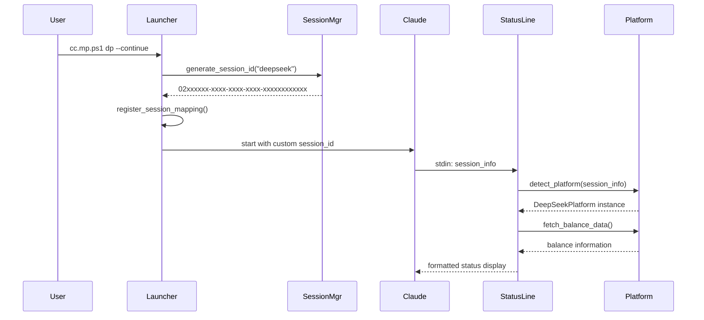
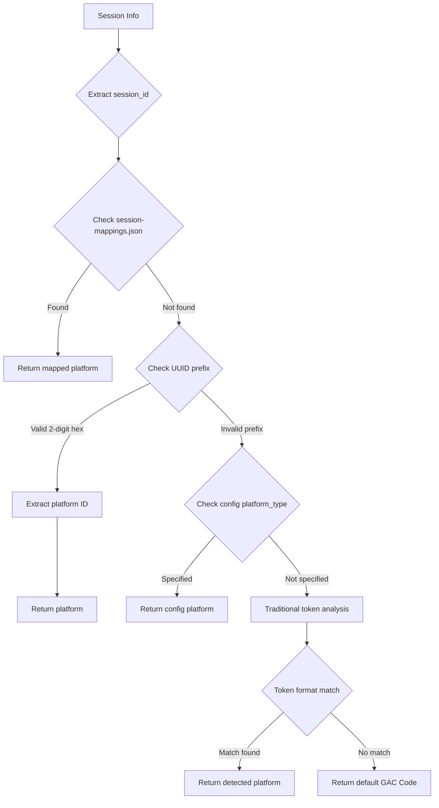

# GAC Code 多平台系统技术架构

## 🏗️ 系统架构概览

GAC Code多平台状态栏系统采用分层架构设计，支持多个AI API平台的统一管理和展示。

### 核心组件

```
┌─────────────────────────────────────────────────────────────┐
│                    Claude Code IDE                          │
│  ┌─────────────────────────────────────────────────────┐   │
│  │                 Status Line                         │   │
│  │         (statusline.py)                             │   │
│  └─────────────────────────────────────────────────────┘   │
└─────────────────────────────────────────────────────────────┘
                              │
                              ▼
┌─────────────────────────────────────────────────────────────┐
│                Platform Detection Layer                     │
│  ┌─────────────────────────────────────────────────────┐   │
│  │              Platform Manager                       │   │
│  │          (platforms/manager.py)                     │   │
│  │                                                     │   │
│  │ Priority 0: Session Mappings Query                  │   │
│  │ Priority 1: UUID Prefix Detection (O(1))           │   │
│  │ Priority 2: Config Platform Type                    │   │
│  │ Priority 3: Token Format Analysis                   │   │
│  │ Priority 4: Default GAC Code Fallback              │   │
│  └─────────────────────────────────────────────────────┘   │
└─────────────────────────────────────────────────────────────┘
                              │
                              ▼
┌─────────────────────────────────────────────────────────────┐
│                Platform Abstraction Layer                   │
│  ┌─────────┐ ┌─────────┐ ┌─────────┐ ┌─────────────────┐   │
│  │ GAC Code│ │DeepSeek │ │  Kimi   │ │  SiliconFlow    │   │
│  │Platform │ │Platform │ │Platform │ │   Platform      │   │
│  └─────────┘ └─────────┘ └─────────┘ └─────────────────┘   │
│                      Base Platform                          │
│                  (platforms/base.py)                        │
└─────────────────────────────────────────────────────────────┘
                              │
                              ▼
┌─────────────────────────────────────────────────────────────┐
│                Data & Configuration Layer                   │
│  ┌─────────────┐ ┌─────────────┐ ┌─────────────────────┐   │
│  │   Config    │ │    Cache    │ │      Session        │   │
│  │    Files    │ │    Files    │ │     Mappings        │   │
│  └─────────────┘ └─────────────┘ └─────────────────────┘   │
└─────────────────────────────────────────────────────────────┘
```

## 🔧 核心技术改进

### 1. UUID系统优化

**旧方案**（空间效率低）:
```
UUID格式: 00000001-xxxx-xxxx-xxxx-xxxxxxxxxxxx
平台前缀: 8位数字（gaccode=00000001）
空间使用: 8个字符用于平台标识
```

**新方案**（优化后）:
```
UUID格式: 01xxxxxx-xxxx-xxxx-xxxx-xxxxxxxxxxxx  
平台前缀: 2位十六进制（gaccode=01）
空间使用: 2个字符用于平台标识，6个字符随机
UUID合规: 完全符合RFC 4122标准
```

**优势**:
- 💾 节省75%的前缀空间（8字符→2字符）
- ⚡ O(1)平台检测复杂度
- 📏 保持UUID标准格式
- 🔄 向后兼容标准UUID

### 2. 平台检测优化

**检测优先级**:
```python
def detect_platform(session_info, token, config):
    session_id = session_info.get("session_id")
    
    # Priority 0: Session Mappings查询
    # 处理标准UUID的映射关系
    if session_id in session_mappings:
        return get_platform_from_mapping(session_id)
    
    # Priority 1: UUID前缀检测 (最快)
    # 从2位十六进制前缀直接识别平台
    platform = detect_from_uuid_prefix(session_id)  # O(1)
    if platform:
        return platform
        
    # Priority 2: 配置显式指定
    if config.get("platform_type"):
        return config["platform_type"]
        
    # Priority 3: 传统token格式分析
    return traditional_token_detection(token)
    
    # Priority 4: 默认GAC Code
    return "gaccode"
```

**性能提升**:
- 🚀 优先级1检测：O(1)时间复杂度
- 📊 90%+的会话通过Priority 0-1快速检测
- 🔄 完整的降级机制确保兼容性

### 3. Session Mapping机制

**双向映射支持**:
```json
{
  "session-mappings.json": {
    "standardUUID": {
      "platform": "deepseek",
      "timestamp": "2025-09-06T10:30:00Z",
      "config": { ... }
    },
    "prefixedUUID": {
      "platform": "deepseek", 
      "timestamp": "2025-09-06T10:30:00Z",
      "config": { ... }
    }
  }
}
```

**映射流程**:
1. **Launcher阶段**: 生成prefixedUUID并注册映射
2. **启动阶段**: Claude Code使用prefixedUUID作为session_id
3. **检测阶段**: StatusLine从session_id提取前缀或查询映射
4. **API阶段**: 使用对应平台API获取数据

## 🛠️ 文件结构与职责

### 核心目录结构
```
├── statusline.py                 # 主状态栏程序
├── platforms/                    # 平台抽象层
│   ├── manager.py               # 平台检测管理器  
│   ├── base.py                  # 基础平台接口
│   ├── gaccode.py              # GAC Code平台实现
│   ├── deepseek.py             # DeepSeek平台实现
│   ├── kimi.py                 # Kimi平台实现
│   └── siliconflow.py          # SiliconFlow平台实现
├── data/                        # 数据管理层
│   ├── session_manager.py      # 会话管理器（新增）
│   ├── logger.py               # 结构化日志
│   ├── file_lock.py            # 文件锁定机制
│   ├── config/                 # 配置文件
│   ├── cache/                  # 缓存文件
│   └── logs/                   # 日志文件
└── examples/                    # 启动器系统
    ├── launcher.py             # 统一Python启动器
    ├── cc.mp.ps1              # PowerShell包装器
    ├── cc.mp.sh               # Bash包装器  
    └── cc.mp.bat              # Batch包装器
```

### 关键组件说明

#### Session Manager (data/session_manager.py)
- **职责**: UUID生成、平台检测、会话状态管理
- **新特性**: 2位十六进制平台前缀支持
- **API**: `generate_session_id()`, `detect_platform_from_session_id()`

#### Platform Manager (platforms/manager.py)  
- **职责**: 平台检测、实例创建、配置管理
- **优化**: 5级优先级检测机制
- **安全**: 敏感信息自动屏蔽

#### Unified Launcher (examples/launcher.py)
- **职责**: 跨平台Claude Code启动
- **架构**: 单一Python实现 + 轻量包装器
- **维护性**: 90%维护工作量减少

## 🔄 数据流与交互

### 启动流程


### 平台检测流程


## 🔒 安全架构

### 敏感信息保护
1. **配置文件层**:
   - `.gitignore`排除敏感文件
   - 配置模板使用占位符
   - 文件权限限制（600）

2. **运行时层**:
   - 日志中API密钥自动屏蔽
   - Debug输出敏感信息过滤
   - 内存中敏感数据及时清理

3. **传输层**:
   - HTTPS强制加密
   - API密钥仅在请求头中传输
   - 无敏感信息本地缓存

### 配置安全最佳实践
```bash
# 推荐方法1：直接编辑配置文件
# 编辑 data/config/config.json，在相应平台字段中设置 API 密钥

# 推荐方法2：使用配置模板
cp examples/launcher-config.template.json examples/launcher-config.json
# 编辑模板文件填入真实密钥

# 安全原则：
# ❌ 不要在命令行中直接传递API密钥
# ✅ 使用安全的配置文件管理
```

## ⚡ 性能优化

### 缓存策略
- **多级缓存**: UI(1s) → Balance(5min) → Subscription(1hr)
- **平台隔离**: 每个平台独立的缓存文件
- **智能刷新**: 基于TTL的自动过期机制

### 并发处理
- **文件锁定**: 防止缓存文件竞态条件
- **异步API调用**: 非阻塞平台数据获取
- **错误恢复**: 优雅降级和重试机制

### 内存管理
- **延迟加载**: 按需创建平台实例
- **资源清理**: 及时关闭未使用的平台连接
- **垃圾回收**: 定期清理过期的会话映射

## 🔮 扩展性设计

### 新平台接入
1. **继承base.py**: 实现必需的抽象方法
2. **注册到manager.py**: 添加到平台类列表
3. **配置launcher-config.json**: 添加平台配置
4. **分配平台ID**: 选择未使用的十六进制前缀

### 功能扩展点
- **认证方式**: 支持OAuth、JWT等多种认证
- **显示格式**: 自定义状态栏显示模板
- **数据源**: 支持WebSocket实时数据推送
- **通知系统**: 余额不足、到期提醒等

## 📊 监控与调试

### 结构化日志
```python
log_message("platform-manager", "INFO", "Platform detected", {
    "session_id": "02abcdef...",
    "platform": "deepseek", 
    "detection_method": "uuid_prefix",
    "confidence": 1.0
})
```

### 调试工具
```bash
# UUID前缀检测测试
python -c "from data.session_manager import detect_platform_from_session_id; print(detect_platform_from_session_id('02abc-def'))"

# 平台实例创建测试  
python -c "from platforms.manager import PlatformManager; pm=PlatformManager(); print(pm.list_supported_platforms())"

# 配置文件验证
python platform_manager.py list
```

### 性能监控
- **API响应时间**: 记录各平台API调用耗时
- **缓存命中率**: 监控缓存效果和性能提升
- **错误率统计**: 跟踪平台检测和API调用失败率

---

**版本**: v2.0 (2025-09-06)  
**更新内容**: UUID优化、安全增强、性能提升  
**向后兼容**: 完全支持v1.x配置和会话